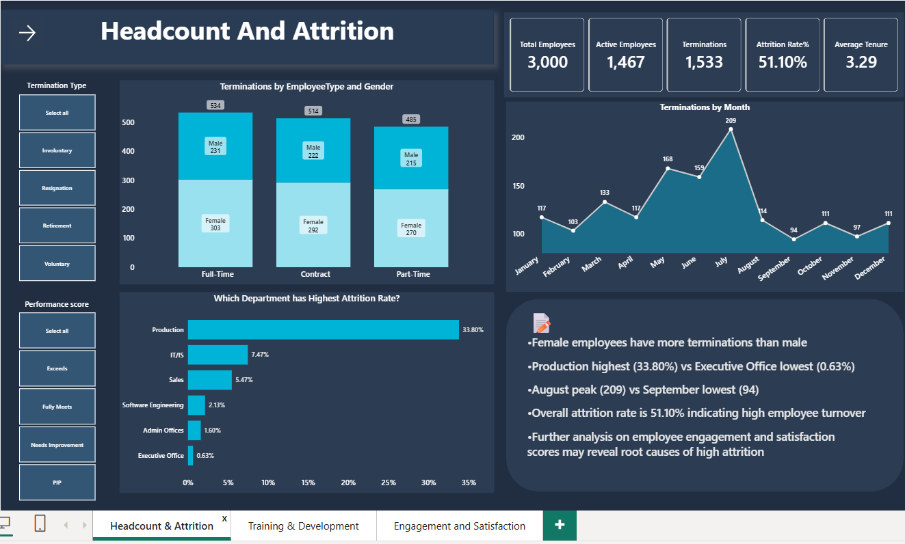
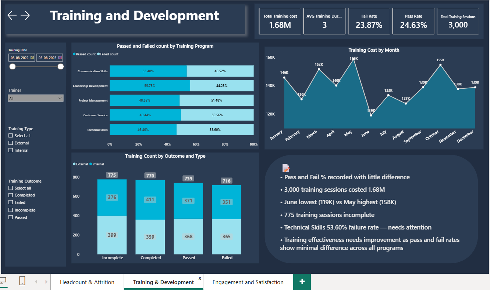
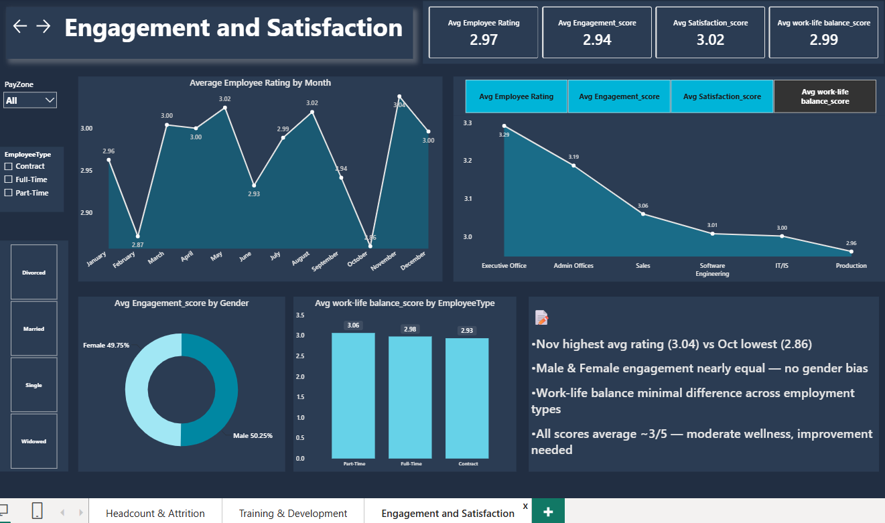

# HR Analytics Dashboard - Power BI

## Dashboard Preview

---

## Tools Used
- **Power BI Desktop** — Dashboard development
- **Power Query** — Data cleaning & transformation
- **DAX** — KPIs and calculated measures

---

## Dataset
- **Source:** [HR Analytics Dataset - Kaggle](https://www.kaggle.com/code/abdelazizelserty/hr-analytics-dataset?select=Messy_HR_Dataset_Detailed.csv)
- **Cleaned Data File:**  [HR Cleaned Dataset](HR_cleaned_dataset.csv)
- **Records:** 3,000 rows | 35+ columns

---

## Data Cleaning
- Merged First Name & Last Name into Full Name
- Changed Employee ID from Integer to Text
- Created End Date column (Exit Date or Today's date for active employees)
- Calculated Tenure in Years
- Removed irrelevant columns (Location Code, Race Description, Business Unit)
- Removed duplicate rows

---

## Dashboard Features

### Page 1 — Headcount & Attrition
- KPIs: Total Employees, Active Employees, Terminations, Attrition Rate%, Avg Tenure
- Terminations by Employee Type and Gender
- Attrition Rate by Department
- Terminations trend by Month
- Slicers: Termination Type, Performance Score

### Page 2 — Training & Development
- KPIs: Total Training Cost, Avg Duration, Pass%, Fail%, Total Sessions
- Pass & Fail rate by Training Program
- Training Cost trend by Month
- Training Count by Outcome and Type
- Slicers: Training Date, Trainer, Training Type, Training Outcome

### Page 3 — Engagement & Satisfaction
- KPIs: Avg Employee Rating, Engagement Score, Satisfaction Score, Work-Life Balance Score
- Avg Rating trend by Month
- Scores by Department
- Engagement by Gender
- Work-Life Balance by Employee Type
- Slicers: PayZone, Employee Type, Marital Status

---

## Key Insights
- Overall attrition rate is 51.10% indicating high employee turnover
- Production department has the highest attrition rate (33.80%) vs Executive Office lowest (0.63%)
- August recorded peak terminations (209) vs September lowest (94)
- Technical Skills training has the highest failure rate at 53.60%
- 775 training sessions remain incomplete out of 3,000
- All engagement and satisfaction scores average ~3/5 indicating moderate employee wellness

---

## Business Recommendations
- Investigate root causes of high attrition in Production department
- Redesign Technical Skills training curriculum to improve pass rates
- Set deadlines and reminders for 775 incomplete training sessions
- Conduct pulse surveys to understand why wellness scores are averaging mid-range
- Analyze August termination spike — likely post-appraisal resignations

---

## Limitations
- Dataset spans multiple years — attrition rate of 51.10% is cumulative, not annual
- Business Unit column had unclear abbreviations and was excluded
- Single table model — no star schema or relationship modelling applied
- Exit interview data contains unstructured text and could not be used for meaningful analysis

---

## Author
**Sriramya Durga K**
- LinkedIn: *www.linkedin.com/in/sriramya-durga-k*
- GitHub: *https://github.com/Sriramya-k*

